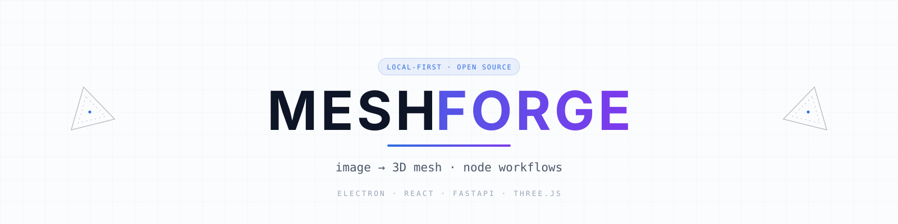
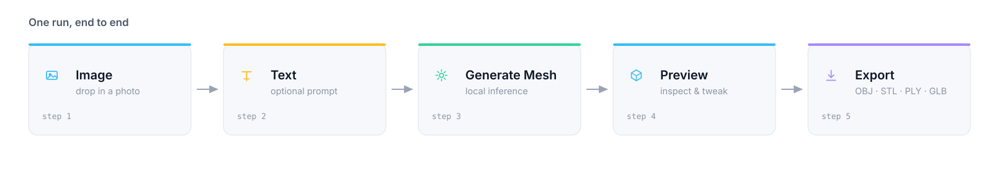
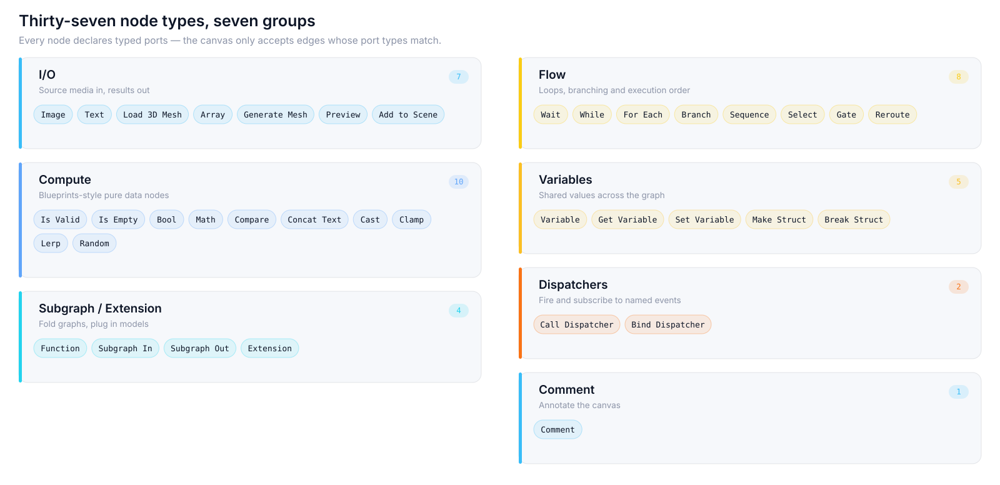
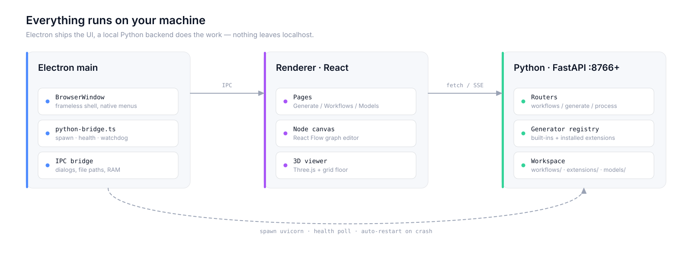
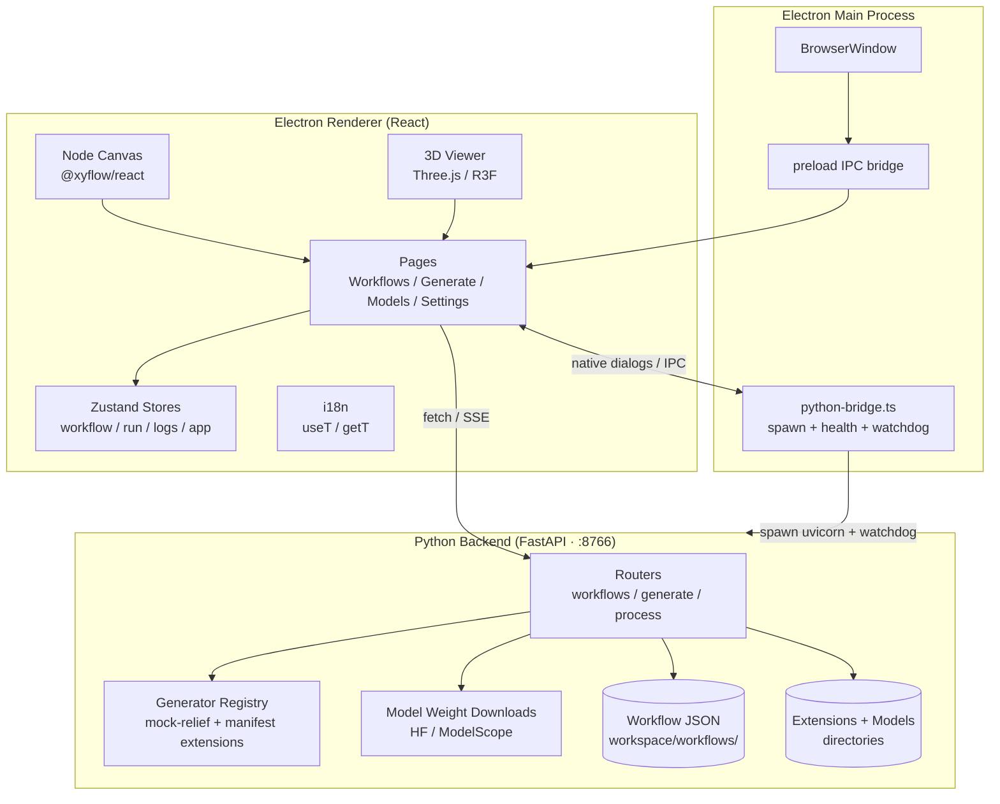
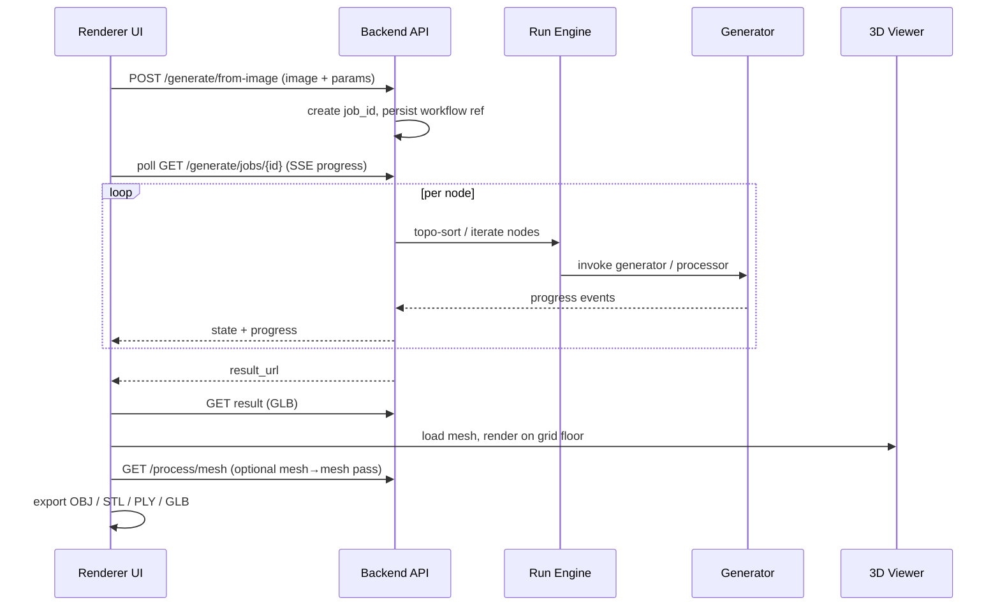
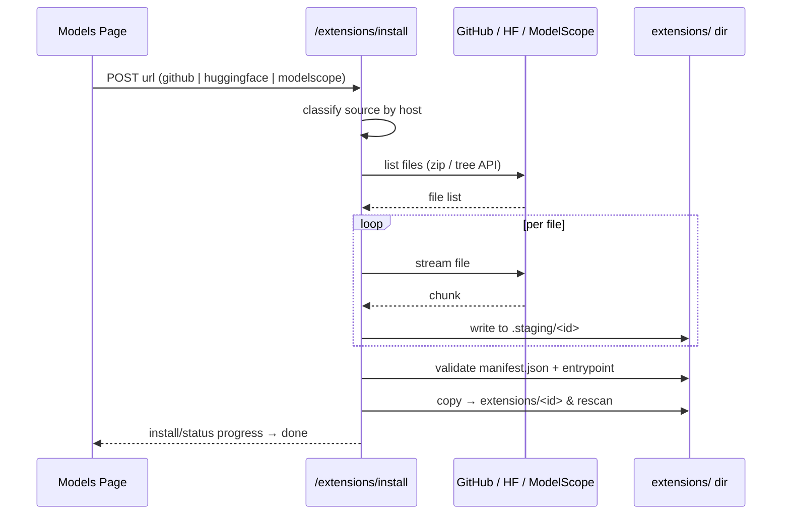
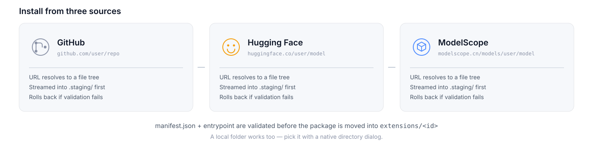

<p align="center">
  <a href="README.zh-CN.md">简体中文</a> | <strong>English</strong>
</p>

<p align="center">
  
</p>

<p align="center">
  <strong>Local, open-source image-to-3D mesh generation for consumer GPUs</strong>
</p>

<p align="center">
  <a href="#system-architecture"></a>
  <a href="https://github.com/lightningpixel/modly"></a>
  <a href="#license"></a>
</p>

<p align="center">
  <a href="#introduction">Introduction</a> ·
  <a href="#node-types">Node Types</a> ·
  <a href="#system-architecture">Architecture</a> ·
  <a href="#data-flow">Data Flow</a> ·
  <a href="#getting-started">Getting Started</a> ·
  <a href="#extensions">Extensions</a> ·
  <a href="#i18n">i18n</a> ·
  <a href="#license">License</a>
</p>

> **MeshForge** is an independent, node-based re-implementation of the open-source [Modly](https://github.com/lightningpixel/modly) image-to-3D workflow desktop app. You build a directed graph of **Image / Text / Mesh / Generator / Preview / Wait / While / ForEach** nodes, run it, and turn a single photo into a textured 3D mesh — all locally, targeting consumer GPUs.

***

## Introduction

A single run walks the graph left to right: an **Image** and a **Text** node feed a **Generate Mesh** node, whose output is previewed in the 3D viewport and/or added to the scene for export.

<p align="center">
  
</p>

- 🎨 **Node-based workflow canvas** — React Flow graph editing with undo/redo, autosave, folders, bookmarks and keyboard shortcuts.

- 🧊 **3D viewport** — real-time Three.js preview with a grid ground plane and multi-format export (OBJ / STL / PLY / GLB).

- 🧩 **Extensible** — install generators and processing tools from **GitHub, HuggingFace or ModelScope (魔搭)**.

- 🌐 **Bilingual UI** — switch between **English** and **中文** in Settings, persisted across restarts.

- 🚀 **Local-first** — the Python backend runs inside Electron with a watchdog auto-restart; no cloud round-trips.

***

## Node Types

Nine built-in node types. Every node declares typed ports, and edges only connect when the port types match — the canvas refuses invalid links instead of failing at run time.

<p align="center">
  
</p>

| Group | Nodes | Notes |
| ----- | ----- | ----- |
| **Inputs** | Image, Text | Load a source photo or a free-form prompt |
| **Mesh I/O** | Load 3D Mesh, Generate Mesh | Import an existing mesh, or run a generator extension |
| **Output** | Preview, Add to Scene | Render in the 3D viewport, or push into the scene workspace |
| **Control flow** | Wait, While, For Each | Delays, conditional loops and batch iteration |

***

## System Architecture

Three processes cooperate: the **Electron main** process owns the window and spawns the Python backend, the **React renderer** owns all UI state, and the **FastAPI backend** owns jobs, files and model downloads.

<p align="center">
  
</p>

<details>
<summary><strong>Expand Mermaid source</strong></summary>



</details>

***

## Data Flow

One run = one job. The renderer posts the image and parameters, the backend creates a job, topologically walks the graph node by node, then streams progress back over SSE until the GLB result is ready.

<details>
<summary><strong>Expand sequence diagram</strong></summary>



</details>

### Extension Install Flow



***

## Getting Started

### Requirements

- **Node.js** 18+

- **Python** 3.10+ (`fastapi`, `uvicorn`, `pydantic`, `Pillow`)

- A GPU with ≥ 6 GB VRAM recommended (developed on an **RTX 4050 6G**)

- Ships with a **mock** generator by default; wire in a real model via [Extensions](#extensions) — or the built-in Hunyuan3D-2-mini adapter below — for true inference.

### Install & Run

```bash
npm install
pip install fastapi uvicorn pydantic Pillow
npm run dev        # development (live reload)
# or
npm run build      # production bundle
```

> The app launches an Electron window that manages the backend lifecycle automatically — no separate server to start.

| Command                  | Purpose                     |
| ------------------------ | --------------------------- |
| `npm run dev`            | Dev mode with live reload   |
| `npm run build`          | Production build            |
| `npm run typecheck:web`  | TypeScript check (renderer) |
| `npm run typecheck:node` | TypeScript check (main)     |

***

## Local Hunyuan3D-2-mini Inference

MeshForge ships with a CPU *mock relief* generator so the whole UI works out of the box. To generate true **image → 3D mesh** results with Hunyuan3D-2-mini on a local GPU (**≥ 6 GB VRAM**):

1. One-click setup (requires [uv](https://docs.astral.sh/uv/)) — creates a Python 3.11 + CUDA venv, installs `hy3dgen==2.0.2` and its runtime deps from a CN mirror, and downloads the weights (repo `tencent/Hunyuan3D-2mini`, subfolders `hunyuan3d-dit-v2-mini` / `hunyuan3d-vae-v2-mini` / `hunyuan3d-vae-v2-mini-withencoder`) into `server\models\`:
   ```
   scripts\setup-hunyuan-server.bat
   ```
2. Start the inference service:
   ```
   scripts\start-hunyuan-server.bat        # listens on http://127.0.0.1:8767
   ```

   The launcher auto-detects the weights in this order: `HY3DGEN_MODELS` env → legacy `D:\github\models` → `server\models`. Prefer manual setup? The exact commands live in `server/requirements-hunyuan.txt`.
3. In the UI pick the **Hunyuan3D 2 mini (Real)** generator. The adapter
   (`server/generators/hunyuan.py`) probes `/health` and POSTs the image to
   `/generate`, saving the returned GLB — no extra config as long as the
   service runs on the default port (override with `MESHFORGE_HUNYUAN_URL`).

Generation parameters (set on the workflow node):

| Param | Default | Effect |
|---|---|---|
| `steps` | 20 | Denoising steps; 20–30 is the sweet spot on a 6 GB GPU |
| `guidance` | 4.0 | How tightly the result follows the input image (4–7 typical; >10 over-saturates) |
| `octree` | 256 | Volume reconstruction resolution — 256 / 320 / 384; higher = finer surface detail, more VRAM & time (384 risks OOM on 6 GB) |
| `seed` | -1 | `-1` = random each run; fix a positive value to reproduce a result — run several seeds and keep the best |
| `remove_base` | on | Cut the thin support disc the model often adds under the object (ground-shadow artefact) — turn off to keep a genuine base design |

Design note: the lightweight MeshForge backend stays free of PyTorch — the model runs in a separate process (`server/hunyuan_service.py`, Python 3.11 + CUDA venv) that shares a minimal `/health` + `/generate` (multipart image → GLB) contract with the adapter.

***

## MCP Server (Claude Desktop / Codex)

Expose MeshForge to external AI agents through the [Model Context Protocol](https://modelcontextprotocol.io). The backend already runs on `http://127.0.0.1:8766` (start the app, or `uvicorn main:app`); `server/mcp_server.py` is a thin stdio adapter over it:

| Tool | Purpose |
|---|---|
| `meshforge_health` | Backend reachability check |
| `meshforge_list_generators` | Registered generators, load state and parameters |
| `meshforge_generate_from_image` | Submit a job: image path + generator (default `hunyuan3d-2-mini`) + optional `steps` / `guidance` / `octree` / `seed` / `remove_base` |
| `meshforge_get_job_status` | Poll a job; on success reports the served URL **and** the absolute `.glb` path on disk |
| `meshforge_cancel_job` | Cooperative cancellation |
| `meshforge_import_mesh` | Import an existing `.glb` / `.obj` / `.stl` / `.ply` into the workspace |

MCP deps are optional on purpose (kept out of the lean backend venv):

```
server\.venv\Scripts\python.exe -m pip install -r server\requirements-mcp.txt
```

Claude Desktop — add to `~/.config/claude/claude_desktop_config.json`:

```json
{
  "mcpServers": {
    "meshforge": {
      "command": "C:/Users/HELLOWORLD/Desktop/oss/meshforge/server/.venv/Scripts/python.exe",
      "args": ["C:/Users/HELLOWORLD/Desktop/oss/meshforge/server/mcp_server.py"]
    }
  }
}
```

Adjust the two absolute paths to your clone location. For real GPU generation the Hunyuan inference service on `:8767` must also be running (section above). Smoke-test the handshake anytime with `python scripts\test_mcp_stdio.py`.

***

## Extensions

Install packages that add new `generator.py` (model) or `processor.py` (mesh-to-mesh) nodes from multiple sources:

<p align="center">
  
</p>

1. Open **Models / Extensions**.
2. Pick an install source — **GitHub · Hugging Face · ModelScope (魔搭)**.
3. Paste the repository URL and install. The backend resolves the URL, streams the files, validates `manifest.json` + entrypoint, then registers the extension.

You can also install from a **local folder** via a native directory dialog.

***

## i18n

Dependency-free internalization layer (Zustand + `localStorage`). Switch under **Settings → Application → Interface → Language**; English is default, 中文 fully supported for labels, placeholders and errors.

***

## Roadmap

- [x] Node-based workflow canvas + run engine

- [x] Generate & 3D preview, multi-format export

- [x] Extensions install from **GitHub / HuggingFace / ModelScope**

- [x] English / 中文 language switching

- [x] Crash recovery, backend watchdog, install rollback

- [x] Wire the real **Hunyuan3D-2-mini** inference model (local GPU, image → mesh)

***

## Acknowledgements

Built as an independent re-implementation of the workflow UX of [lightningpixel/modly](https://github.com/lightningpixel/modly).

***

## License

Released under the [MIT License](LICENSE).
