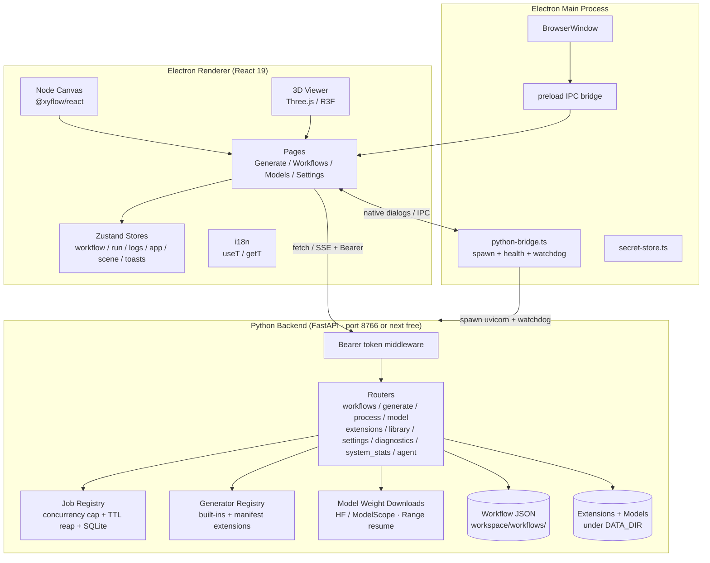
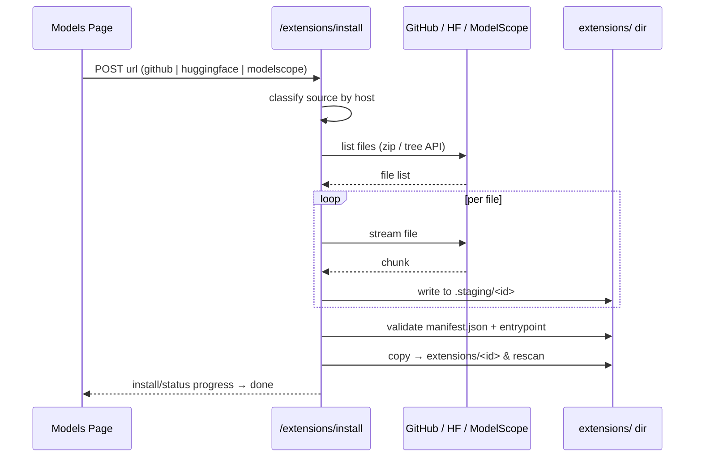

<p align="center">
  <a href="README.zh-CN.md">简体中文</a> | <strong>English</strong>
</p>

<p align="center">
  
</p>

<p align="center">
  <strong>Local, open-source image-to-3D mesh generation for consumer GPUs</strong>
</p>

<p align="center">
  <a href="#system-architecture"></a>
  <a href="#node-types"></a>
  <a href="#built-in-generators--categories"></a>
  <a href="#license"></a>
</p>

<p align="center">
  <a href="#introduction">Introduction</a> ·
  <a href="#node-types">Node Types</a> ·
  <a href="#system-architecture">Architecture</a> ·
  <a href="#data-flow">Data Flow</a> ·
  <a href="#getting-started">Getting Started</a> ·
  <a href="#project-layout">Layout</a> ·
  <a href="#built-in-generators--categories">Generators</a> ·
  <a href="#deploying-local-models">Deployment</a> ·
  <a href="#mcp-server">MCP</a> ·
  <a href="#tests--quality-gates">Tests</a> ·
  <a href="#packaging--distribution">Packaging</a> ·
  <a href="#license">License</a>
</p>

> **MeshForge** is a node-based image-to-3D desktop app: build a directed graph on the canvas and turn a single photo into a textured 3D mesh. Everything runs locally, targeting consumer GPUs.

***

## Introduction

A single run walks the graph left to right: an **Image** and a **Text** node feed a **Generate Mesh** node, whose output is previewed in the 3D viewport and then exported or pushed into the scene workspace.

<p align="center">
  
</p>

- 🎨 **Node-based workflow canvas** — React Flow graph editing with undo/redo, autosave, folders, bookmarks and keyboard shortcuts; **typed ports** are validated on connect, so invalid links are refused up front.

- 🧊 **3D viewport** — real-time Three.js preview with a grid ground plane and multi-format export (OBJ / STL / PLY / GLB).

- 🧩 **Extensible** — install generators and processing tools from **GitHub, HuggingFace or ModelScope**, or from a local folder.

- 🌐 **Bilingual UI** — switch between **English** and **中文** in Settings, persisted across restarts.

- 🚀 **Local-first** — the Python backend is spawned and watched by Electron; requests are guarded by a local **Bearer token**, and no data leaves localhost.

- ⚙️ **Built-in job queue** — one job per model by default (so runs don't fight over VRAM); overflow waits in a cancellable queue, and terminal states persist to SQLite so history survives restarts.

***

## Node Types

**37 built-in node types in seven groups.** Every node declares typed ports, and edges only connect when the port types match — the canvas refuses invalid links instead of failing at run time.

<p align="center">
  
</p>

| Group | Nodes | Notes |
| ----- | ----- | ----- |
| **I/O** | Image · Text · Load 3D Mesh · Array · Generate Mesh · Preview · Add to Scene | Load a source photo, a prompt or an existing mesh; preview and push results into the scene |
| **Flow** | Wait · While · For Each · Branch · Sequence · Select · Gate · Reroute | Delays, loops, branching and execution ordering |
| **Compute** | Is Valid · Is Empty · Bool · Math · Compare · Concat Text · Cast · Clamp · Lerp · Random | Pure data nodes for predicates and numeric/text maths |
| **Variables** | Variable · Get Variable · Set Variable · Make Struct · Break Struct | Values shared across the graph; struct assembly and teardown |
| **Dispatchers** | Call Dispatcher · Bind Dispatcher | Fire named events, running every bound downstream chain |
| **Subgraph / Extension** | Function · Subgraph In · Subgraph Out · Extension | Fold a selection into one node; plug in extension models |
| **Comment** | Comment | Annotate the canvas |

<details>
<summary><strong>About typed ports</strong></summary>

There are four port types: `image`, `text`, `mesh` and `any` (wildcard). Connection validation lives in `src/pages/workflows/canvas/validConnection.ts`, and the node spec table is `NODE_SPECS` in `src/types.ts`.

Extension nodes take their port types from the extension's own schema rather than `NODE_SPECS` — so installing a multiview model makes pins matching its input signature appear on the canvas.

Nodes can also **fold upward** (the small chevron at the right of the title bar). Once folded, only **wired** pins remain: an unconnected pin is not merely hidden but never rendered, so it exists in neither connection validation nor hit-testing. The fold state lives in the node's `collapsed` param and is saved with the workflow. The decision logic is in `src/pages/workflows/nodes/primitives.tsx` (`NodeShell` + `useConnectedHandles`).

</details>

***

## System Architecture

Three processes cooperate: the **Electron main** process owns the window and spawns the Python backend, the **React renderer** owns all UI state, and the **FastAPI backend** owns jobs, files and model downloads.

<p align="center">
  
</p>

<details>
<summary><strong>Expand Mermaid source</strong></summary>



</details>

### Ports and Auth

| Item | Behaviour |
| --- | --- |
| **Inside the desktop app** | The backend **picks a free port starting at 8766**; the effective port is passed to the renderer and the MCP server via `MESHFORGE_API_PORT` |
| **Standalone** | `uvicorn main:app` (from inside `server/`) listens on `127.0.0.1:8766` by default |
| **Auth** | Every API request needs `Authorization: Bearer <token>`. Electron generates a random token per launch and injects it as `MESHFORGE_API_TOKEN`; standalone, the backend generates one and writes `DATA_DIR/.api-token` (kept outside the workspace so it is never served by static mounts) |
| **CORS** | Local origins only; preflight requests bypass auth |

> The MCP server reads `.api-token` and attaches the auth header automatically — no manual configuration.

***

## Data Flow

One run = one job. The renderer posts the image and parameters, the backend creates a job, topologically walks the graph node by node, then streams progress back over SSE until the GLB result is ready.

<details>
<summary><strong>Expand sequence diagram</strong></summary>

```mermaid
sequenceDiagram
    participant UI as Renderer UI
    participant API as Backend API
    participant Job as Job Queue
    participant Eng as Run Engine
    participant Gen as Generator
    participant View as 3D Viewer

    UI->>API: POST /generate/from-image (image + params + Bearer)
    API->>Job: create job_id; queue if over the concurrency cap
    UI->>API: GET /generate/jobs/{id} (SSE progress)
    Job->>Eng: dequeue, then walk nodes in topological order
    loop per node
        Eng->>Gen: invoke generator / processor
        Gen-->>API: progress events
        API-->>UI: state + progress
    end
    API->>Job: write terminal state to SQLite (jobs.db)
    API-->>UI: result_url
    UI->>API: GET result (GLB)
    UI->>View: load mesh, render on grid floor
    UI->>API: GET /process/mesh (optional mesh→mesh pass)
    UI->>UI: export OBJ / STL / PLY / GLB
```

</details>

### Extension Install Flow



A failure at any step rolls back, leaving no half-installed state.

***

## Getting Started

### Requirements

- **Node.js** 22+ (CI uses 22)
- **Python** 3.13 (CI uses 3.13; 3.10+ should work)
- A GPU with ≥ 6 GB VRAM recommended (developed on an **RTX 4050 6G**)
- Ships with a CPU **mock relief** generator so the UI works out of the box; see [Deploying Local Models](#deploying-local-models) for real inference

### Install & Run

```bash
npm install

# Backend dependencies (single source of truth = server/requirements.txt)
python -m venv server/.venv
# Windows:
server/.venv/Scripts/python.exe -m pip install -r server/requirements.txt
# macOS / Linux:
# server/.venv/bin/python -m pip install -r server/requirements.txt

npm run dev        # development (live reload)
# or
npm run build      # production bundle
```

> The app launches an Electron window that manages the backend lifecycle automatically — no separate server to start.
> The `server/.venv/Scripts/python.exe` spelling below is Windows; on macOS / Linux use `server/.venv/bin/python`.

### Common Commands

| Command | Purpose |
| --- | --- |
| `npm run dev` | Dev mode with live reload |
| `npm run build` | Production build (electron-vite) |
| `npm run pack` | Pack an unpacked directory (`electron-builder --dir`) |
| `npm run dist` | Build + pack installers |
| `npm run lint` / `lint:fix` | oxlint check / autofix |
| `npm run typecheck:web` | TypeScript check (renderer) |
| `npm run typecheck:node` | TypeScript check (main) |
| `npm run sizes` | Bundle size budget check |
| `npm test` | Run all offline tests |

### Environment Variables

| Variable | Default | Purpose |
| --- | --- | --- |
| `MESHFORGE_DATA_DIR` | `server/` in dev; injected by Electron in packaged builds | Root for mutable data (workspace / models / extensions / `.api-token` / `jobs.db`) |
| `MESHFORGE_API_PORT` | `8766` | Backend port; the desktop app re-picks a free port and reports it back |
| `MESHFORGE_API_TOKEN` | auto-generated | Bearer token for the local API |
| `MESHFORGE_SERVICES_ROOT` | `D:\github` | Root for inference-service venvs and weights (machine-specific paths live only here) |
| `MESHFORGE_MAX_CONCURRENT_PER_MODEL` | `1` | Concurrent jobs per model; overflow queues |
| `MESHFORGE_ALLOW_SANDBOX` | unset | Set to `1` to stop appending Chromium `--no-sandbox` (appended by default to work around a broker defect on some machines) |

Each generator service additionally honours `<NAME>_URL` / `<NAME>_PY` / `<NAME>_MODEL_ROOT` / `<NAME>_AUTOSTART` — see [Deploying Local Models](#deploying-local-models).

***

## Project Layout

```
meshforge/
├── electron/                  # Electron main process + preload
│   ├── main/index.ts          # window, menus, command-line switches
│   ├── main/python-bridge.ts  # spawns the backend: spawn + health + watchdog
│   ├── main/secret-store.ts   # local secret storage
│   └── preload/index.ts       # IPC bridge (native dialogs / file paths / RAM)
│
├── src/                       # React renderer
│   ├── api/                   # backend clients (http + per-resource modules)
│   ├── components/            # Chrome / ErrorBoundary / Toasts / Viewer3D / ui
│   ├── hooks/                 # useFocusTrap
│   ├── i18n/                  # en.ts / zh.ts / index.ts (zero-dep, useT + getT)
│   ├── pages/
│   │   ├── GeneratePage.tsx   # generate: params, chat panel, library panel
│   │   ├── WorkflowsPage.tsx  # canvas, node palette, subgraph editor
│   │   ├── ModelsPage.tsx     # model/extension install, uninstall, progress
│   │   ├── settings/          # settings page
│   │   ├── workflows/nodes/   # 37 node components (io/flow/compute/variables/…)
│   │   └── models/            # extension cards, drawer, install progress
│   ├── stores/                # Zustand: workflows / workflowRun / app / logs / scene / toasts / navigation
│   └── styles/                # tokens.css (dual-theme vars) + per-page styles
│
├── server/                    # Python FastAPI backend
│   ├── main.py                # app assembly + Bearer token middleware
│   ├── config.py              # centralised path & runtime config (single source)
│   ├── jobs.py / jobstore.py  # job registry (cap, TTL, SQLite persistence)
│   ├── schemas.py             # Pydantic models
│   ├── mcp_server.py          # MCP stdio adapter
│   ├── routers/               # workflows / generate / process / model / extensions
│   │   │                      # / library / settings / diagnostics / system_stats / agent
│   ├── generators/            # generator adapters + registry.py
│   ├── tools/mesh_tools.py    # CPU mesh ops (repair/smooth/remesher/optimizer/exporter)
│   ├── *_service.py           # standalone service entrypoints (not part of the core backend)
│   └── tests/                 # path-boundary / jobs / workflows unit tests
│
├── scripts/                   # tests and asset generators
├── assets/                    # README banners and diagrams (SVG, theme-aware)
├── docs/openapi.json          # OpenAPI contract snapshot (checked in CI)
└── .github/workflows/ci.yml   # CI: 5 jobs
```

***

## Built-in Generators & Categories

Generators declare a `category` describing their output type; the UI groups by it and colours canvas nodes accordingly:

<p align="center">
  
</p>

| Category | Meaning | Output | Built-in adapters (port) |
| --- | --- | --- | --- |
| `mesh` | image → 3D mesh | GLB | Hunyuan3D-2 mini (8767) · turbo (8768) · 50-step (8775) · MV turbo (8771) · MV fast (8774) · MV 50-step (8776) · InstantMesh large (8770) · InstantMesh base (8777) |
| `multiview` | image / text → multiview sheet | PNG sheet | MVDream (text-driven 4 views, 8780) · Stable Zero123 (8781) · Wonder3D Plus (6 views, 8782) |
| `image` | image → image utilities | PNG | RMBG-2.0 · BiRefNet · Real-ESRGAN x2 · Depth-Anything-V2 · MoGe · M-LSD · CodeFormer · Universal Matting (sharing `imageopt_service.py`, 8783) |
| `process` | mesh → mesh | mesh | `mesh-repair` · `mesh-smoother` · `mesh-remesher` · `mesh-optimizer` · `mesh-exporter` (CPU, trimesh + numpy) |

Category colours match the workflow canvas (`mesh` green / `multiview` teal / `image` magenta) — see `EXTENSION_CATEGORY_COLOR` in `src/types.ts`.

- **`multiview`** returns a single PNG contact sheet rather than a mesh, so the Models page groups it separately.
- **`image`** models all run on one shared `imageopt_service.py` (port 8783), distinguished by their `tool` field.
- **`process`** tools run on CPU. When `pymeshlab` is installed (listed in `server/requirements.txt`) they upgrade to QEM decimation, robust non-manifold repair and hole closing; otherwise they fall back to pure numpy.

<details>
<summary><strong>Image preprocessing model list</strong></summary>

A curated, cross-checked list with ModelScope links and ✓ usable / ⚠ mislabeled marks lives in
`server/configs/image_preprocess_models.json`, covering matting / upscaling / depth·normal·camera / edge.

</details>

***

## Deploying Local Models

The MeshForge backend **deliberately stays free of PyTorch** — all real inference runs in **separate processes** that talk to the adapters over a minimal HTTP contract. You install only the models you need, and the core app stays lean.

### Service Overview

Every inference service is "a venv + weights + a `*_service.py`":

| Service | venv (under `MESHFORGE_SERVICES_ROOT`) | Weights dir (under `SERVICES_ROOT/models`) | Port |
| --- | --- | --- | --- |
| Hunyuan3D 2 (mini / turbo / 50-step / MV) | `hy3dgen-venv` | set via `HY3DGEN_MODELS` | 8767 / 8768 / 8775 / 8771 / 8774 / 8776 |
| InstantMesh | `instantmesh-venv` | `instant-mesh-large` | 8770 / 8777 |
| MVDream | `mvdream-venv` | `MVDream` | 8780 |
| Stable Zero123 | `zero123-venv` | `stable-zero123` | 8781 |
| Wonder3D Plus | `wonder3d-venv` | `Wonder3D_plus` | 8782 |
| Image utilities (`image` category) | `imageopt-venv` | `ImageOptimization/<tool>` | 8783 |

### Auto-start

**The backend starts these services on demand** — you don't manage windows yourself:

1. check whether the service's venv interpreter exists;
2. check whether the weights marker file exists;
3. when both are present, spawn it and wait for the health check.

If either is missing it **does not auto-start**, and loading the node reports a clear reason. Disable auto-start with `<NAME>_AUTOSTART=0` (e.g. `MESHFORGE_HUNYUAN_AUTOSTART=0`), or override paths with `<NAME>_PY` / `<NAME>_MODEL_ROOT`.

### Hunyuan3D-2-mini Example

To produce true **image → 3D mesh** results on a local GPU (**≥ 6 GB VRAM**):

1. **Set up the environment** (requires [uv](https://docs.astral.sh/uv/)) — create a Python 3.11 + CUDA venv and install `hy3dgen==2.0.2` plus its runtime deps from a CN mirror. The exact commands live in `server/requirements-hunyuan.txt`.
2. **Download the weights** — repo `tencent/Hunyuan3D-2mini`, subfolders `hunyuan3d-dit-v2-mini` / `hunyuan3d-vae-v2-mini` / `hunyuan3d-vae-v2-mini-withencoder`, into `models/` under the services root; or hit the matching card under **Settings → Downloads** to pull them through the ModelScope CLI.
   Weight lookup order: `HY3DGEN_MODELS` env var → `server/models`.
3. **Pick it in the UI** — choose the **Hunyuan3D 2 mini (Real)** generator; the adapter (`server/generators/hunyuan.py`) starts the service for you, or point `MESHFORGE_HUNYUAN_URL` at one already running.

**Generation parameters** (set on the workflow node):

| Param | Default | Effect |
| --- | --- | --- |
| `steps` | 20 | Denoising steps; 20–30 is the sweet spot on a 6 GB GPU |
| `guidance` | 4.0 | How tightly the result follows the input image (4–7 typical; >10 over-saturates) |
| `octree` | 256 | Volume reconstruction resolution — 256 / 320 / 384. Higher = finer surface detail, more VRAM and time (**384 risks OOM on 6 GB**) |
| `seed` | -1 | `-1` = random each run; fix a positive value to reproduce a result — run several seeds and keep the best |
| `remove_base` | on | Cut the thin support disc the model often adds under the object (ground-shadow artefact) — turn off to keep a genuine base design |

> Design note: the adapter and the inference service only share `GET /health` and `POST /generate` (multipart image → GLB). That means **you can write your own service** implementing the same contract and swap out the built-in one.

***

## MCP Server

Expose MeshForge to external AI agents through the [Model Context Protocol](https://modelcontextprotocol.io). The backend must be running (start the app, or `uvicorn main:app` from inside `server/`); `server/mcp_server.py` is a thin stdio adapter over it:

| Tool | Purpose |
| --- | --- |
| `meshforge_health` | Backend reachability check |
| `meshforge_list_generators` | Registered generators, load state and parameters |
| `meshforge_generate_from_image` | Submit a job: image path + generator (default `hunyuan3d-2-mini`) + optional `steps` / `guidance` / `octree` / `seed` / `remove_base` |
| `meshforge_get_job_status` | Poll a job; on success reports the served URL **and** the absolute `.glb` path on disk |
| `meshforge_cancel_job` | Cooperative cancellation |
| `meshforge_import_mesh` | Import an existing `.glb` / `.obj` / `.stl` / `.ply` into the workspace |

MCP deps are optional on purpose (kept out of the lean backend venv):

```bash
server/.venv/Scripts/python.exe -m pip install -r server/requirements-mcp.txt
```

Claude Desktop — add to `~/.config/claude/claude_desktop_config.json`:

```json
{
  "mcpServers": {
    "meshforge": {
      "command": "/absolute/path/to/meshforge/server/.venv/Scripts/python.exe",
      "args": ["/absolute/path/to/meshforge/server/mcp_server.py"]
    }
  }
}
```

Adjust the two absolute paths to your clone location. Smoke-test the handshake with:

```bash
npm run test:stdio
```

***

## Extensions

Install packages that add new `generator.py` (model) or `processor.py` (mesh-to-mesh) nodes:

<p align="center">
  
</p>

1. Open **Models / Extensions**.
2. Pick an install source — **GitHub · Hugging Face · ModelScope (魔搭)**.
3. Paste the repository URL and install. The backend resolves the URL, streams the files, validates `manifest.json` + entrypoint, then registers the extension.

You can also install from a **local folder** via a native directory dialog. Everything lands in `.staging/` first and only moves into `extensions/<id>` after validation — failures roll back automatically.

***

## Tests & Quality Gates

Regression helpers live in `scripts/` and `server/tests/`, wired into npm (they use the backend venv created during setup):

| Command | What it checks | Needs services running? |
| --- | --- | --- |
| `npm test` | Runs all offline checks below | No |
| `npm run test:paths` | Path boundaries (traversal, workspace escape, zip-slip, atomic saves) | No |
| `npm run test:jobs` | Job registry (concurrency cap, TTL reap, cancel, restart recovery) | No |
| `npm run test:workflows` | Workflow CRUD (atomic write, corrupted-file skip, size limit, ordering) | No |
| `npm run test:web` | Frontend logic (URL joining, i18n fallback + interpolation, store migration) | No |
| `npm run test:nodes` | Workflow node semantics (all 37 node types' execution and error branches, topo + exec scheduling, loops and cancellation, subgraphs) | No |
| `npm run test:ui` | Node control rendering (SSR: image preview + clear affordance, multiview params render no bogus input boxes, folding a node keeps only wired pins) | No |
| `npm run test:stdio` | MCP stdio JSON-RPC handshake + tools/list | No |
| `npm run test:pipeline` | Model download pipeline (mock HF hub: done / pause / cancel / resume) | No |
| `npm run test:modeldl` | Model download catalog (ModelScope CLI probe, banner filtering, card profiles, installed-state) | No |
| `npm run test:modeldl:live` | Live model-download smoke (runs one real SSE stream, README.md only) | No (needs network + `modelscope`) |
| `npm run test:mvparams` | Multiview generator param contract (3 nodes, no label params, `pin_only` defaults still drive inference) | No |
| `npm run test:genparams` | Generator (mesh) param contract (8 nodes, all numeric params `pin_only`, schema default == runtime fallback, the four view-index mappings stay editable, selects untouched) | No |
| `npm run test:imgparams` | Image-processing node param contract (8 nodes, no VRAM / 6GB-card hints, dead `low_vram` gone, real params survive) | No |
| `npm run test:extstate` | Extension uninstall persistence (built-ins survive a restart, disabled list + restore round-trip, manifest extensions still really delete) | No |
| `npm run test:toolbar` | Workflow toolbar button-size contract (scoped sizing rule present, all five button classes resolve to one height, colour-modifier classes stay size-free) | No |
| `npm run openapi:check` | Whether the OpenAPI snapshot matches the code | No |
| `npm run test:generate` | Real image-to-3D generation through MCP | **Yes** — backend + inference service + weights |

### CI Pipeline

`.github/workflows/ci.yml` runs five jobs:

| Job | Contents |
| --- | --- |
| `frontend` | `npm ci` → typecheck both sides → renderer unit tests (`test:web` + `test:nodes` + `test:ui` + `test:toolbar`) → build → bundle size budget |
| `python` | install deps (via `requirements*.txt`, no hardcoded package lists) → `compileall` → eight unit-test suites → OpenAPI snapshot → MCP stdio smoke → `pip check` |
| `integration` | real uvicorn → health check → 401↔200 auth verification → workflows CRUD → readiness probe |
| `quality` | oxlint → `npm audit` → `pip check` → SBOM (CycloneDX) |
| `package` | electron-builder packaging |

> **Note**: green on local Windows ≠ green in CI. Cross-platform projects should assume every platform-specific implicit behaviour (path semantics, time precision, filesystem traversal order, line endings) will break in CI. `.gitattributes` is checked in to pin EOL.

***

## Packaging & Distribution

```bash
npm run pack     # unpacked directory (dist/win-unpacked), for local smoke testing
npm run dist     # build + produce installers
```

Configuration lives in `electron-builder.yml`:

| Platform | Artifacts |
| --- | --- |
| **Windows** | NSIS installer + portable zip (x64) |
| **macOS** | dmg + zip (x64 / arm64) |
| **Linux** | AppImage + deb (x64) |

Notes:

- The app itself (`out/**`) is packed into an asar; main-process deps are bundled, so no `node_modules` needs shipping.
- **The Python backend ships as source** (`extraResources` copies `server/` to `resources/server`), excluding `.venv` / `__pycache__` / `workspace` / `models`.
- **A self-contained Python runtime ships too**: `server/.runtime/` (embeddable Python + backend deps, including the `modelscope` download CLI) is produced by `scripts/prepare_bundled_python.py` — run `npm run prepare:runtime` before packing. `python-bridge` probes `.runtime` → `.venv` → system `python`, so the installer runs both the backend and model downloads on machines without Python installed.
- In packaged builds all mutable data goes to `app.getPath('userData')`; the install directory keeps only immutable program files.
- No signing certificate is configured, so Windows skips signing and macOS users must right-click to open.

***

## i18n

A dependency-free internationalisation layer (Zustand + `localStorage`), with dictionaries in `src/i18n/en.ts` and `zh.ts`.

- Use `useT()` inside components and `getT()` elsewhere.
- The Chinese dictionary is typed as `typeof en`, so **the compiler enforces an identical key set** — a missing key fails typecheck.
- English is the default; 中文 fully covers labels, placeholders and errors.
- Switch under **Settings → Application → Interface → Language**.

***

## Roadmap

- [x] Node-based workflow canvas + run engine (37 nodes / 7 groups, with subgraph folding)
- [x] Generate & 3D preview, multi-format export (OBJ / STL / PLY / GLB)
- [x] Extensions install from **GitHub / HuggingFace / ModelScope** or a local folder
- [x] English / 中文 language switching (compile-time key parity)
- [x] Crash recovery, backend watchdog, install rollback
- [x] Wire the real **Hunyuan3D-2-mini** inference model (local GPU, image → mesh)
- [x] Four generator categories (`mesh` / `multiview` / `image` / `process`) with grouped, colour-coded UI
- [x] Built-in **multiview** models — MVDream / Stable Zero123 / Wonder3D Plus
- [x] Built-in **image** models — matting / upscaling / depth / normal / line detection / face restore
- [x] CPU mesh tools — Taubin smoothing, QEM remesh, non-manifold repair (+ optional `pymeshlab`)
- [x] Local API **Bearer token** auth + job queue (concurrency cap / TTL / SQLite persistence)
- [x] **MCP Server** for external agents
- [x] Three-platform packaging (Windows / macOS / Linux) + five-job CI

***

## Acknowledgements

Built as an independent of the workflow UX of [lightningpixel/modly](https://github.com/lightningpixel/modly).

***

## License

Released under the [MIT License](LICENSE).
