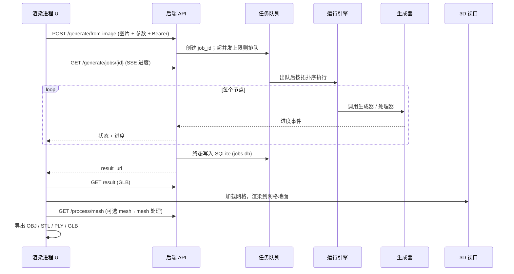
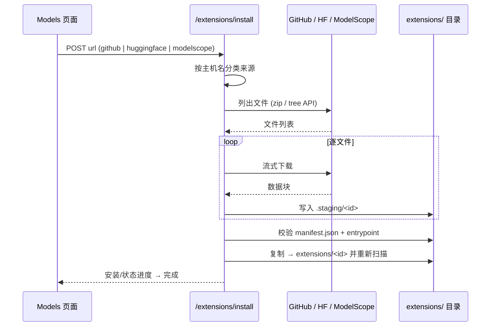
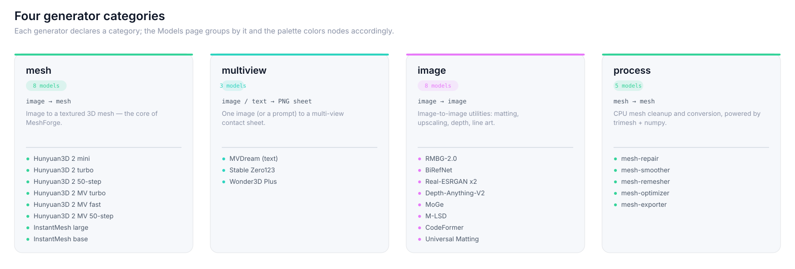

<p align="center">
  <strong>简体中文</strong> | <a href="README.md">English</a>
</p>

<p align="center">
  
</p>

<p align="center">
  <strong>本地、开源的图生 3D 网格生成桌面应用，面向消费级 GPU</strong>
  <br/>
  <em>Local, open-source image-to-3D mesh generation for consumer GPUs</em>
</p>

<p align="center">
  <a href="#系统架构"></a>
  <a href="#节点类型"></a>
  <a href="#生成器与分类"></a>
  <a href="#许可"></a>
</p>

<p align="center">
  <a href="#简介">简介</a> ·
  <a href="#节点类型">节点类型</a> ·
  <a href="#系统架构">系统架构</a> ·
  <a href="#数据流">数据流</a> ·
  <a href="#快速开始">快速开始</a> ·
  <a href="#项目结构">项目结构</a> ·
  <a href="#生成器与分类">生成器</a> ·
  <a href="#本地模型部署">部署</a> ·
  <a href="#mcp-server">MCP</a> ·
  <a href="#测试与质量门禁">测试</a> ·
  <a href="#打包分发">打包</a> ·
  <a href="#许可">许可</a>
</p>

> **MeshForge** 是一款节点式图生 3D 桌面应用：在画布上搭一张有向图，把一张照片变成带纹理的 3D 网格。全程本地运行，面向消费级 GPU。

***

## 简介

一次运行就是从左到右走一遍节点图：**Image** 与 **Text** 汇入 **Generate Mesh**，结果在 3D 视口预览，再导出或推入场景工作区。

<p align="center">
  
</p>

- 🎨 **节点式工作流画布** — 基于 React Flow 的图编辑，支持撤销/重做、自动保存、文件夹、书签与快捷键；带完整**类型化端口**校验，非法连线当场拒绝。

- 🧊 **3D 视口** — Three.js 实时预览，网格地面，支持 OBJ / STL / PLY / GLB 多格式导出。

- 🧩 **可扩展** — 从 **GitHub、HuggingFace 或 ModelScope（魔搭）** 安装生成器与处理工具，也可从本地文件夹安装。

- 🌐 **双语界面** — 设置中切换 **English / 中文**，重启后保持。

- 🚀 **本地优先** — Python 后端由 Electron 拉起并带看门狗自动重启；请求走本机 **Bearer token** 认证，数据不出 localhost。

- ⚙️ **内置任务队列** — 同一模型默认串行执行（避免争抢显存），超限任务排队且可取消；终态落 SQLite，重启后仍可查历史。

***

## 节点类型

**37 种内置节点，分七组。** 每个节点声明带类型的端口，只有端口类型匹配的边才能连上——画布直接拒绝非法连线，而不是等到运行时才报错。

<p align="center">
  
</p>

| 分组 | 节点 | 说明 |
| ---- | ---- | ---- |
| **输入 / 输出** | Image · Text · Load 3D Mesh · Array · Generate Mesh · Preview · Add to Scene | 载入源照片、提示词或已有网格；预览结果并推入场景 |
| **控制流** | Wait · While · For Each · Branch · Sequence · Select · Gate · Reroute | 延时、循环、分支与执行顺序编排 |
| **逻辑与运算** | Is Valid · Is Empty · Bool · Math · Compare · Concat Text · Cast · Clamp · Lerp · Random | 纯数据节点，做判定与数值/文本计算 |
| **变量** | Variable · Get Variable · Set Variable · Make Struct · Break Struct | 跨节点共享取值；结构体组装与拆解 |
| **事件分发** | Call Dispatcher · Bind Dispatcher | 按名触发事件，执行所有已绑定的下游链路 |
| **子图与扩展** | Function · Subgraph In · Subgraph Out · Extension | 把一组节点折叠成单节点（函数）；接入扩展模型 |
| **注释** | Comment | 在画布上留说明 |

<details>
<summary><strong>关于类型化端口</strong></summary>

端口类型共 4 种：`image`、`text`、`mesh`、`any`（通配）。连接校验在 `src/pages/workflows/canvas/validConnection.ts`，节点规格表在 `src/types.ts` 的 `NODE_SPECS`。

扩展节点（`Extension`）的端口类型来自扩展自己的 schema，而非 `NODE_SPECS`——因此安装一个多视图模型后，画布上会出现与它输入签名匹配的引脚。

节点可以**向上折叠**（标题栏右端的小箭头）。折起来后只保留**有连线**的引脚：没接线的引脚直接不渲染，而非视觉隐藏——连线校验与命中区里都不存在它。折叠态存在节点参数 `collapsed` 里，随工作流一起保存。判据在 `src/pages/workflows/nodes/primitives.tsx`（`NodeShell` + `useConnectedHandles`）。

</details>

***

## 系统架构

三个进程协同：**Electron 主进程**负责窗口并拉起 Python 后端，**React 渲染进程**持有全部 UI 状态，**FastAPI 后端**负责任务、文件与模型下载。

<p align="center">
  
</p>

<details>
<summary><strong>展开 Mermaid 源码</strong></summary>

```mermaid
flowchart TB
    subgraph Renderer["Electron 渲染进程 (React 19)"]
        UI[页面<br/>Generate / Workflows / Models / Settings]
        Canvas[节点画布<br/>@xyflow/react]
        Viewer[3D 视口<br/>Three.js / R3F]
        Store[Zustand 状态<br/>workflow / run / logs / app / scene / toasts]
        I18N[i18n<br/>useT / getT]
    end

    subgraph Main["Electron 主进程"]
        Win[BrowserWindow]
        Bridge[python-bridge.ts<br/>spawn + 健康检查 + 看门狗]
        Secret[secret-store.ts]
        IPC[preload IPC 桥接]
    end

    subgraph Backend["Python 后端 (FastAPI · 8766 起自动选空闲端口)"]
        Auth[Bearer token 中间件]
        API[路由<br/>workflows / generate / process / model<br/>extensions / library / settings / diagnostics / system_stats / agent]
        Jobs[任务注册表<br/>并发上限 + TTL 清理 + SQLite]
        Registry[生成器注册表<br/>内置 + manifest 扩展]
        Model[模型权重下载<br/>HF / ModelScope · Range 续传]
        Repo[(工作流 JSON<br/>workspace/workflows/)]
        ExtDir[(扩展 + 模型<br/>DATA_DIR 下)]
    end

    UI --> Store
    Canvas --> UI
    Viewer --> UI
    UI -->|fetch / SSE + Bearer| Auth
    Auth --> API
    API --> Jobs
    API --> Registry
    API --> Model
    API --> Repo
    API --> ExtDir
    UI <-->|原生对话框 / IPC| Bridge
    Bridge -->|spawn uvicorn + 看门狗| Backend
    Win --> IPC --> UI
```

</details>

### 端口与认证

| 项 | 行为 |
| --- | --- |
| **桌面应用内** | 后端**从 8766 起自动选空闲端口**，实际端口经环境变量 `MESHFORGE_API_PORT` 告知渲染层与 MCP server |
| **独立运行** | `uvicorn main:app`（在 `server/` 目录内），默认监听 `127.0.0.1:8766` |
| **认证** | 所有 API 请求须带 `Authorization: Bearer <token>`。Electron 每次启动生成随机 token 并经 `MESHFORGE_API_TOKEN` 注入后端；独立运行时后端自行生成并写入 `DATA_DIR/.api-token`（放在 workspace 之外，不会被静态挂载公开） |
| **CORS** | 仅放行本机来源，预检请求免认证 |

> MCP server 会自动读取 `.api-token` 并在请求里带上认证头，无需手动配置。

***

## 数据流

一次运行 = 一个任务。渲染进程提交图片与参数，后端创建任务、按拓扑序逐节点执行，并通过 SSE 持续回传进度，直到 GLB 结果就绪。

<details>
<summary><strong>展开时序图</strong></summary>



</details>

### 扩展安装流程



任一环节失败都会回滚，不会留下半装状态。

***

## 快速开始

### 环境要求

- **Node.js** 22+（CI 使用 22）
- **Python** 3.13（CI 使用 3.13；3.10+ 应可运行）
- 建议 ≥ 6 GB 显存的 GPU（开发机为 **RTX 4050 6G**）
- 默认自带 **mock 浮雕**生成器，UI 开箱即用；接真实模型见[本地模型部署](#本地模型部署)

### 安装与运行

```bash
npm install

# 后端依赖（唯一事实来源 = server/requirements.txt）
python -m venv server/.venv
# Windows:
server/.venv/Scripts/python.exe -m pip install -r server/requirements.txt
# macOS / Linux:
# server/.venv/bin/python -m pip install -r server/requirements.txt

npm run dev        # 开发模式（热重载）
# 或
npm run build      # 生产构建
```

> 应用会启动 Electron 窗口并自动管理后端生命周期——无需手动另起服务。
> 下文命令里的 `server/.venv/Scripts/python.exe` 是 Windows 写法，macOS / Linux 对应 `server/.venv/bin/python`。

### 常用命令

| 命令 | 用途 |
| --- | --- |
| `npm run dev` | 开发模式，带热重载 |
| `npm run build` | 生产构建（electron-vite） |
| `npm run pack` | 打包为免安装目录（`electron-builder --dir`） |
| `npm run dist` | 构建 + 打包为安装包 |
| `npm run lint` / `lint:fix` | oxlint 检查 / 自动修复 |
| `npm run typecheck:web` | TypeScript 检查（渲染层） |
| `npm run typecheck:node` | TypeScript 检查（主进程） |
| `npm run sizes` | 前端产物体积预算检查 |
| `npm test` | 运行全部离线测试 |

### 环境变量

| 变量 | 默认 | 作用 |
| --- | --- | --- |
| `MESHFORGE_DATA_DIR` | 开发态为 `server/`；打包态由 Electron 注入用户数据目录 | 可变数据根（workspace / models / extensions / `.api-token` / `jobs.db`） |
| `MESHFORGE_API_PORT` | `8766` | 后端监听端口；桌面应用会自动改选空闲端口并回填 |
| `MESHFORGE_API_TOKEN` | 自动生成 | 本地 API 的 Bearer token |
| `MESHFORGE_SERVICES_ROOT` | `D:\github` | 各推理服务的 venv 与权重根目录（机器相关路径只允许出现在这里） |
| `MESHFORGE_MAX_CONCURRENT_PER_MODEL` | `1` | 同一模型同时执行的任务数上限，超限排队 |
| `MESHFORGE_ALLOW_SANDBOX` | 未设置 | 设为 `1` 时不再追加 Chromium `--no-sandbox`（默认追加以规避部分机器的 broker 缺陷） |

各生成器服务还支持 `<NAME>_URL` / `<NAME>_PY` / `<NAME>_MODEL_ROOT` / `<NAME>_AUTOSTART` 覆盖，详见[本地模型部署](#本地模型部署)。

***

## 项目结构

```
meshforge/
├── electron/                  # Electron 主进程 + preload
│   ├── main/index.ts          # 窗口、菜单、命令行开关
│   ├── main/python-bridge.ts  # 拉起后端：spawn + 健康检查 + 看门狗
│   ├── main/secret-store.ts   # 本机密钥存取
│   └── preload/index.ts       # IPC 桥接（原生对话框 / 文件路径 / 内存信息）
│
├── src/                       # React 渲染进程
│   ├── api/                   # 后端客户端（http + 各资源模块）
│   ├── components/            # Chrome / ErrorBoundary / Toasts / Viewer3D / ui
│   ├── hooks/                 # useFocusTrap
│   ├── i18n/                  # en.ts / zh.ts / index.ts（零依赖，useT + getT）
│   ├── pages/
│   │   ├── GeneratePage.tsx   # 生成页：参数、对话面板、库面板
│   │   ├── WorkflowsPage.tsx  # 工作流页：画布、节点面板、子图编辑器
│   │   ├── ModelsPage.tsx     # 模型/扩展页：安装、卸载、进度
│   │   ├── settings/          # 设置页
│   │   ├── workflows/nodes/   # 37 种节点组件（io/flow/compute/variables/…）
│   │   └── models/            # 扩展卡片、抽屉、安装进度
│   ├── stores/                # Zustand：workflows / workflowRun / app / logs / scene / toasts / navigation
│   └── styles/                # tokens.css（双主题变量）+ 各页面样式
│
├── server/                    # Python FastAPI 后端
│   ├── main.py                # 应用装配 + Bearer token 中间件
│   ├── config.py              # 集中式路径与运行配置（唯一路径来源）
│   ├── jobs.py / jobstore.py  # 任务注册表（并发上限、TTL、SQLite 持久化）
│   ├── schemas.py             # Pydantic 模型
│   ├── mcp_server.py          # MCP stdio 适配层
│   ├── routers/               # workflows / generate / process / model / extensions
│   │   │                      # / library / settings / diagnostics / system_stats / agent
│   ├── generators/            # 生成器适配器 + registry.py（注册表）
│   ├── tools/mesh_tools.py    # CPU 网格处理（repair/smooth/remesher/optimizer/exporter）
│   ├── *_service.py           # 各推理服务的独立进程入口（不属于核心后端）
│   └── tests/                 # 路径边界 / 任务 / 工作流单测
│
├── scripts/                   # 测试与资产生成工具
├── assets/                    # README 横幅与插图（SVG，主题自适应）
├── docs/openapi.json          # OpenAPI 契约快照（CI 校验）
└── .github/workflows/ci.yml   # CI：5 个 job
```

***

## 生成器与分类

生成器按 `category` 区分输出类型，界面据此分组并在画布上着色：

<p align="center">
  
</p>

| 分类 | 含义 | 输出 | 内置适配器（端口） |
| --- | --- | --- | --- |
| `mesh` | 图片 → 3D 网格 | GLB | Hunyuan3D-2 mini (8767) · turbo (8768) · 标准 50 步 (8775) · MV turbo (8771) · MV fast (8774) · MV 标准 (8776) · InstantMesh large (8770) · InstantMesh 低显存 (8777) |
| `multiview` | 图/文本 → 多视图拼图 | PNG 拼图 | MVDream（文本驱动 4 视图, 8780）· Stable Zero123 (8781) · Wonder3D Plus（6 视图, 8782） |
| `image` | 图 → 图 图像处理 | PNG | RMBG-2.0 · BiRefNet · Real-ESRGAN x2 · Depth-Anything-V2 · MoGe · M-LSD · CodeFormer · Universal Matting（共用一个 `imageopt_service.py`, 8783） |
| `process` | 网格 → 网格 | 网格 | `mesh-repair` · `mesh-smoother` · `mesh-remesher` · `mesh-optimizer` · `mesh-exporter`（CPU，trimesh + numpy） |

分类配色与工作流画布一致（`mesh` 绿 / `multiview` 青绿 / `image` 品红），见 `src/types.ts` 的 `EXTENSION_CATEGORY_COLOR`。

- **`multiview`** 返回的是一张 PNG 拼图，不是网格，因此在 Models 页单独归类展示。
- **`image`** 类全部跑在共享的 `imageopt_service.py` 上（单端口 8783），靠 `tool` 字段区分具体模型。
- **`process`** 工具基于 CPU。安装了 `pymeshlab`（已列入 `server/requirements.txt`）时自动升级为 QEM 减面、稳健的非流形修复与孔洞闭合；缺失时回退纯 numpy 实现。

<details>
<summary><strong>图像预处理模型清单</strong></summary>

一份经核对、带 ModelScope 链接与 ✓ 可用 / ⚠ 错位标记的清单位于
`server/configs/image_preprocess_models.json`，覆盖抠图 / 超分 / 深度·法线·相机 / 边缘四类。

</details>

***

## 本地模型部署

MeshForge 的核心后端**刻意不引入 PyTorch**——所有真实推理都跑在**独立进程**里，通过极简的 HTTP 契约与适配器通信。因此你可以只装用得上的模型，核心应用始终保持轻量。

### 部署模型总览

每个推理服务都是「一个 venv + 一份权重 + 一个 `*_service.py`」：

| 服务 | venv（相对 `MESHFORGE_SERVICES_ROOT`） | 权重目录（相对 `SERVICES_ROOT/models`） | 端口 |
| --- | --- | --- | --- |
| Hunyuan3D 2 (mini / turbo / 标准 / MV) | `hy3dgen-venv` | 由 `HY3DGEN_MODELS` 指定 | 8767 / 8768 / 8775 / 8771 / 8774 / 8776 |
| InstantMesh | `instantmesh-venv` | `instant-mesh-large` | 8770 / 8777 |
| MVDream | `mvdream-venv` | `MVDream` | 8780 |
| Stable Zero123 | `zero123-venv` | `stable-zero123` | 8781 |
| Wonder3D Plus | `wonder3d-venv` | `Wonder3D_plus` | 8782 |
| 图像处理（`image` 类） | `imageopt-venv` | `ImageOptimization/<工具名>` | 8783 |

### 自动拉起

**后端会按需自动拉起这些服务**，你不用手动开窗口：

1. 检查该服务的 venv 解释器是否存在；
2. 检查权重 marker 文件是否存在；
3. 两者齐备则拉起进程并等待健康检查通过。

缺任一项就**不自动启动**，节点加载时报出明确原因。可用 `<NAME>_AUTOSTART=0` 关闭自动拉起（如 `MESHFORGE_HUNYUAN_AUTOSTART=0`），也可用 `<NAME>_PY` / `<NAME>_MODEL_ROOT` 覆盖路径。

### Hunyuan3D-2-mini 示例

要在本地 GPU（**≥ 6 GB 显存**）跑真正的图片 → 3D 网格：

1. **准备环境**（需 [uv](https://docs.astral.sh/uv/)）—— 创建 Python 3.11 + CUDA venv，从国内镜像安装 `hy3dgen==2.0.2` 及运行时依赖。完整命令见 `server/requirements-hunyuan.txt`。
2. **下载权重** —— 仓库 `tencent/Hunyuan3D-2mini`，子目录 `hunyuan3d-dit-v2-mini` / `hunyuan3d-vae-v2-mini` / `hunyuan3d-vae-v2-mini-withencoder`，放入服务根下的 `models/`；也可在 **设置 → 模型下载** 里点对应卡片一键拉取（经 ModelScope CLI）。
   权重探测顺序：`HY3DGEN_MODELS` 环境变量 → `server/models`。
3. **在界面里选用** —— 选择 **Hunyuan3D 2 mini (Real)** 生成器即可，适配器（`server/generators/hunyuan.py`）会自动拉起服务，也可用 `MESHFORGE_HUNYUAN_URL` 指向已在运行的服务。

**生成参数**（在工作流节点上设置）：

| 参数 | 默认 | 作用 |
| --- | --- | --- |
| `steps` 采样步数 | 20 | 去噪步数；6GB 显存下 20–30 是甜点区间 |
| `guidance` 引导强度 | 4.0 | 结果贴合输入图的程度（4–7 常用；>10 易过曝） |
| `octree` 重建分辨率 | 256 | 体积重建分辨率：256 / 320 / 384。越高表面细节越丰富，显存与耗时增加（**6GB 卡 384 有爆显存风险**） |
| `seed` 随机种子 | -1 | `-1` = 每次随机；固定为正数可复现同一结果——换多个种子各跑一次，留下最满意的一个 |
| `remove_base` 去底部圆盘 | 开启 | 自动切除模型底部由地面阴影产生的支撑圆盘（单图重建模型的常见产物）——需要保留真实底座设计时关闭 |

> 设计说明：适配器与推理服务之间只约定 `GET /health` 与 `POST /generate`（multipart 图片 → GLB）两个接口。这意味着你**可以自己写一个符合该契约的服务**来替换内置实现。

***

## MCP Server

通过 [Model Context Protocol](https://modelcontextprotocol.io) 把 MeshForge 暴露给外部 AI 智能体。后端需已在运行（启动应用，或在 `server/` 目录内 `uvicorn main:app`）；`server/mcp_server.py` 是一个极薄的 stdio 适配层：

| 工具 | 作用 |
| --- | --- |
| `meshforge_health` | 后端可达性检查 |
| `meshforge_list_generators` | 已注册的生成器、加载状态与参数 |
| `meshforge_generate_from_image` | 提交任务：图片路径 + 生成器（默认 `hunyuan3d-2-mini`）+ 可选 `steps` / `guidance` / `octree` / `seed` / `remove_base` |
| `meshforge_get_job_status` | 轮询任务；成功后同时给出服务 URL 与磁盘上的 `.glb` 绝对路径 |
| `meshforge_cancel_job` | 协作式取消 |
| `meshforge_import_mesh` | 把已有的 `.glb` / `.obj` / `.stl` / `.ply` 导入工作区 |

MCP 依赖刻意保持可选（不污染精简版后端 venv）：

```bash
server/.venv/Scripts/python.exe -m pip install -r server/requirements-mcp.txt
```

Claude Desktop —— 在 `~/.config/claude/claude_desktop_config.json` 中添加：

```json
{
  "mcpServers": {
    "meshforge": {
      "command": "/absolute/path/to/meshforge/server/.venv/Scripts/python.exe",
      "args": ["/absolute/path/to/meshforge/server/mcp_server.py"]
    }
  }
}
```

请把两处绝对路径改为你本地的克隆路径。握手冒烟测试：

```bash
npm run test:stdio
```

***

## 扩展

安装扩展包即可新增 `generator.py`（模型）或 `processor.py`（网格到网格处理）节点：

<p align="center">
  
</p>

1. 打开 **Models / Extensions** 页面。
2. 选择安装来源 —— **GitHub · Hugging Face · ModelScope（魔搭）**。
3. 粘贴仓库地址并安装。后端会解析 URL、流式拉取文件、校验 `manifest.json` 与入口文件，然后注册扩展。

也可以通过原生目录对话框**从本地文件夹**安装。安装全程先落到 `.staging/`，校验通过才移入 `extensions/<id>`，失败自动回滚。

***

## 测试与质量门禁

回归脚本在 `scripts/` 与 `server/tests/` 目录，并已接入 npm（自动使用安装阶段创建的后端 venv）：

| 命令 | 检查内容 | 需要服务在运行？ |
| --- | --- | --- |
| `npm test` | 运行下面所有离线检查 | 否 |
| `npm run test:paths` | 路径边界（目录穿越、工作区越权、ZIP 炸弹防护、原子保存） | 否 |
| `npm run test:jobs` | 任务注册表（并发上限、TTL 回收、取消、重启恢复） | 否 |
| `npm run test:workflows` | 工作流 CRUD（原子写、损坏文件跳过、体积上限、排序） | 否 |
| `npm run test:web` | 前端纯逻辑（URL 拼接、i18n 回退与插值、状态迁移） | 否 |
| `npm run test:nodes` | 工作流节点语义（37 种节点的执行/错误分支、拓扑与 exec 调度、循环与取消、子图） | 否 |
| `npm run test:ui` | 节点控件渲染（SSR：图片回显与清除入口、生视图参数不再渲染假输入框、折叠节点只保留已连接的引脚） | 否 |
| `npm run test:stdio` | MCP stdio JSON-RPC 握手 + tools/list | 否 |
| `npm run test:pipeline` | 模型下载管线（模拟 HF Hub：完成/暂停/取消/断点续传） | 否 |
| `npm run test:modeldl` | 模型下载清单（ModelScope CLI 探测、banner 过滤、卡片档案、安装态判定） | 否 |
| `npm run test:modeldl:live` | 模型下载联网冒烟（真跑一次 SSE 流，只下 README.md） | 否（需网络 + `modelscope`） |
| `npm run test:mvparams` | 生视图模型参数契约（3 个节点、无 label 型参数、`pin_only` 默认值仍能驱动推理） | 否 |
| `npm run test:genparams` | 生成器（mesh）参数契约（8 个节点、数字参数全部 `pin_only`、schema 默认值 == 执行期回落值、四视角映射仍可编辑、下拉框未被触碰） | 否 |
| `npm run test:imgparams` | 图像处理节点参数契约（8 个节点、无显存/6GB 卡提示、死控件 `low_vram` 已移除、真参数未被误删） | 否 |
| `npm run test:extstate` | 扩展卸载持久化（内置扩展扛得住重启、停用列表与恢复往返、清单扩展仍真删目录） | 否 |
| `npm run test:toolbar` | 工作流工具栏按钮尺寸契约（作用域尺寸规则在、五类按钮算出的高度一致、颜色修饰类不带尺寸） | 否 |
| `npm run openapi:check` | OpenAPI 契约快照是否与代码一致 | 否 |
| `npm run test:generate` | 经 MCP 跑一次真实图生 3D | **是** —— 后端 + 推理服务 + 权重就绪 |

### CI 流水线

`.github/workflows/ci.yml` 含五个 job：

| Job | 内容 |
| --- | --- |
| `frontend` | `npm ci` → 双端 typecheck → 渲染层单测（`test:web` + `test:nodes` + `test:ui` + `test:toolbar`）→ build → 体积预算 |
| `python` | 依赖安装（引用 `requirements*.txt`，不硬编码包名）→ `compileall` → 八套单测 → OpenAPI 快照 → MCP stdio 冒烟 → `pip check` |
| `integration` | 真实起 uvicorn → 健康检查 → 401↔200 认证验证 → workflows CRUD → readiness 探针 |
| `quality` | oxlint → `npm audit` → `pip check` → SBOM（CycloneDX） |
| `package` | electron-builder 打包 |

> **注意**：本地 Windows 全绿 ≠ CI 绿。跨平台项目要假设"平台相关的隐式行为"（路径语义、时间精度、文件系统序遍历、换行符）都会在 CI 上翻车。仓库内已提供 `.gitattributes` 固定 EOL。

***

## 打包分发

```bash
npm run pack     # 免安装目录（dist/win-unpacked），用于本机冒烟
npm run dist     # 构建 + 生成安装包
```

打包配置见 `electron-builder.yml`：

| 平台 | 产物 |
| --- | --- |
| **Windows** | NSIS 安装包 + 免安装 zip（x64） |
| **macOS** | dmg + zip（x64 / arm64） |
| **Linux** | AppImage + deb（x64） |

要点：

- 应用本体（`out/**`）打进 asar；主进程依赖已被 bundle，无需携带 `node_modules`。
- **Python 后端源码随包携带**（`extraResources` 把 `server/` 复制到 `resources/server`），排除 `.venv` / `__pycache__` / `workspace` / `models`。
- **自包含 Python 运行时随包携带**：`server/.runtime/`（embeddable Python + 后端依赖，含 `modelscope` 下载 CLI）由 `scripts/prepare_bundled_python.py` 生成；打包前先执行 `npm run prepare:runtime`。`python-bridge` 的探测顺序为 `.runtime` → `.venv` → 系统 `python`，安装包因此在未装 Python 的机器上也能直接运行后端与模型下载。
- 打包态下可变数据全部落到 `app.getPath('userData')`，安装目录只保留不可变程序文件。
- 未配置签名证书，因此 Windows 会跳过签名，macOS 需用户右键打开。

***

## i18n

零依赖的国际化层（Zustand + `localStorage`），词典在 `src/i18n/en.ts` 与 `zh.ts`。

- 组件内用 `useT()`，非组件代码用 `getT()`。
- 中文词典的类型标注为 `typeof en`，**编译期强制两份词典键集完全一致**——漏键会直接 typecheck 失败。
- 默认英文，中文完整覆盖标签、占位符与错误信息。
- 切换位置：**Settings → Application → Interface → Language**。

***

## 路线图

- [x] 节点式工作流画布 + 运行引擎（37 种节点 / 7 组，含子图折叠）
- [x] 生成与 3D 预览，多格式导出（OBJ / STL / PLY / GLB）
- [x] 从 **GitHub / HuggingFace / ModelScope** 或本地文件夹安装扩展
- [x] English / 中文 语言切换（编译期键集校验）
- [x] 崩溃恢复、后端看门狗、安装回滚
- [x] 接入真实的 **Hunyuan3D-2-mini** 推理模型（本地 GPU，图生网格）
- [x] 生成器四分类（`mesh` / `multiview` / `image` / `process`）并分组、着色展示
- [x] 内置**多视图**模型 —— MVDream / Stable Zero123 / Wonder3D Plus
- [x] 内置**图像处理**模型 —— 抠图 / 超分 / 深度 / 法线 / 直线检测 / 人像修复
- [x] CPU 网格工具 —— Taubin 平滑、QEM 减面、非流形修复（可选 `pymeshlab`）
- [x] 本地 API **Bearer token** 认证 + 任务队列（并发上限 / TTL / SQLite 持久化）
- [x] **MCP Server** 暴露给外部智能体
- [x] 三平台打包配置（Windows / macOS / Linux）+ CI 五 job

***

## 致谢

作为对 [lightningpixel/modly](https://github.com/lightningpixel/modly) 工作流交互的独立而构建。

***

## 许可

基于 [MIT License](LICENSE) 发布。
