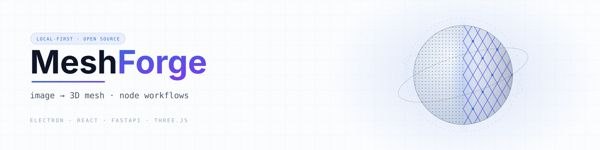
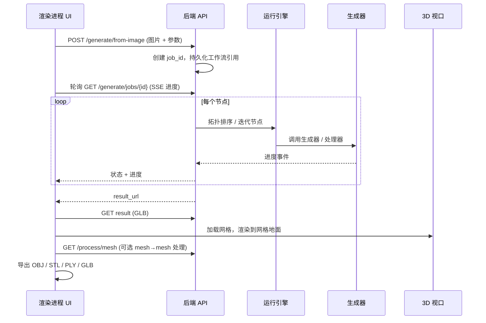
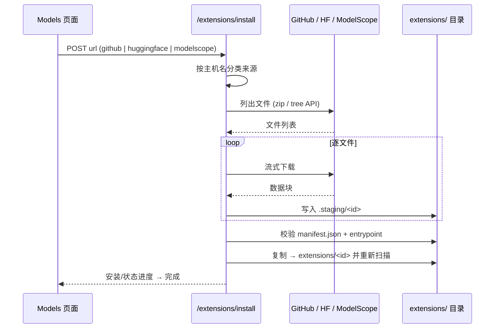

<p align="center">
  <strong>简体中文</strong> | <a href="README.md">English</a>
</p>

<p align="center">
  
</p>

<p align="center">
  <strong>本地、开源的图生 3D 网格生成桌面应用，面向消费级 GPU</strong>
  <br/>
  <em>Local, open-source image-to-3D mesh generation for consumer GPUs</em>
</p>

<p align="center">
  <a href="#系统架构"></a>
  <a href="https://github.com/lightningpixel/modly"></a>
  <a href="#许可"></a>
</p>

<p align="center">
  <a href="#简介">简介</a> ·
  <a href="#节点类型">节点类型</a> ·
  <a href="#系统架构">系统架构</a> ·
  <a href="#数据流">数据流</a> ·
  <a href="#快速开始">快速开始</a> ·
  <a href="#扩展">扩展</a> ·
  <a href="#i18n-语言切换">i18n</a> ·
  <a href="#许可">许可</a>
</p>

> **MeshForge** 是对开源项目 [Modly](https://github.com/lightningpixel/modly) 的独立复刻（图生 3D 桌面应用）：以**工作流节点图**来组织处理流程——搭建一张由 **Image / Text / Mesh / Generator / Preview / Wait / While / ForEach** 节点组成的有向图，运行它，即可把一张照片变成带纹理的 3D 网格。全程本地运行，面向消费级 GPU。

***

## 简介

一次运行就是从左到右走一遍节点图：**Image** 与 **Text** 节点汇入 **Generate Mesh**，其输出在 3D 视口中预览，并可加入场景用于导出。

<p align="center">
  
</p>

- 🎨 **节点式工作流画布** — 基于 React Flow 的图编辑，支持撤销/重做、自动保存、文件夹、书签与快捷键。

- 🧊 **3D 视口** — Three.js 实时预览，带网格地面，支持 OBJ / STL / PLY / GLB 多格式导出。

- 🧩 **可扩展** — 从 **GitHub、HuggingFace 或 ModelScope（魔搭）** 安装生成器与处理工具。

- 🌐 **双语界面** — 在设置中切换 **English / 中文**，重启后保持。

- 🚀 **本地优先** — Python 后端运行在 Electron 内，带看门狗自动重启；无任何云端往返。

***

## 节点类型

内置九种节点。每个节点声明带类型的端口，只有端口类型匹配的边才能连上——画布会直接拒绝非法连线，而不是等到运行时才报错。

<p align="center">
  
</p>

| 分组 | 节点 | 说明 |
| ---- | ---- | ---- |
| **输入** | Image、Text | 载入源照片或自由文本提示词 |
| **网格 I/O** | Load 3D Mesh、Generate Mesh | 导入已有网格，或运行生成器扩展 |
| **输出** | Preview、Add to Scene | 在 3D 视口渲染，或推入场景工作区 |
| **控制流** | Wait、While、For Each | 延时、条件循环与批量迭代 |

***

## 系统架构

三个进程协同工作：**Electron 主进程**负责窗口并拉起 Python 后端，**React 渲染进程**持有全部 UI 状态，**FastAPI 后端**负责任务、文件与模型下载。

<p align="center">
  
</p>

<details>
<summary><strong>展开 Mermaid 源码</strong></summary>

```mermaid
flowchart TB
    subgraph Renderer["Electron 渲染进程 (React)"]
        UI[页面<br/>Workflows / Generate / Models / Settings]
        Canvas[节点画布<br/>@xyflow/react]
        Viewer[3D 视口<br/>Three.js / R3F]
        Store[Zustand 状态<br/>workflow / run / logs / app]
        I18N[i18n<br/>useT / getT]
    end

    subgraph Main["Electron 主进程"]
        Win[BrowserWindow]
        Bridge[python-bridge.ts<br/>spawn + 健康检查 + 看门狗]
        IPC[preload IPC 桥接]
    end

    subgraph Backend["Python 后端 (FastAPI · :8766)"]
        API[路由<br/>workflows / generate / process]
        Registry[生成器注册表<br/>mock-relief + manifest 扩展]
        Model[模型权重下载<br/>HF / ModelScope]
        Repo[(工作流 JSON<br/>workspace/workflows/)]
        ExtDir[(扩展 + 模型<br/>目录)]
    end

    UI --> Store
    Canvas --> UI
    Viewer --> UI
    UI -->|fetch / SSE| API
    API --> Registry
    API --> Model
    API --> Repo
    API --> ExtDir
    UI <-->|原生对话框 / IPC| Bridge
    Bridge -->|spawn uvicorn + 看门狗| Backend
    Win --> IPC --> UI
```

</details>

***

## 数据流

一次运行 = 一个任务。渲染进程提交图片与参数，后端创建任务、按拓扑序逐节点执行，并通过 SSE 持续回传进度，直到 GLB 结果就绪。

<details>
<summary><strong>展开时序图</strong></summary>



</details>

### 扩展安装流程



***

## 快速开始

### 环境要求

- **Node.js** 18+

- **Python** 3.10+（`fastapi`、`uvicorn`、`pydantic`、`Pillow`）

- 建议使用 ≥ 6 GB 显存的 GPU（开发机为 **RTX 4050 6G**）

- 默认自带一个 **mock** 生成器；如需真实推理，可通过[扩展](#扩展)接入，或使用下方内置的 **Hunyuan3D-2-mini** 适配器。

### 安装与运行

```bash
npm install
pip install fastapi uvicorn pydantic Pillow
npm run dev        # 开发模式（热重载）
# 或
npm run build      # 生产构建
```

> 应用会启动 Electron 窗口并自动管理后端生命周期——无需手动另起服务。

| 命令                     | 用途                    |
| ------------------------ | ----------------------- |
| `npm run dev`            | 开发模式，带热重载      |
| `npm run build`          | 生产构建                |
| `npm run typecheck:web`  | TypeScript 检查（渲染层） |
| `npm run typecheck:node` | TypeScript 检查（主进程） |

***

## 本地 Hunyuan3D-2-mini 推理

MeshForge 默认附带 CPU **mock 浮雕**生成器，UI 开箱即用。若要在本地 GPU（**≥ 6 GB 显存**）上运行真正的 **图片 → 3D 网格**：

1. 一键环境安装（需 [uv](https://docs.astral.sh/uv/)）—— 自动创建 Python 3.11 + CUDA venv、从国内镜像安装 `hy3dgen==2.0.2` 及运行时依赖、并把权重（仓库 `tencent/Hunyuan3D-2mini`，子目录 `hunyuan3d-dit-v2-mini` / `hunyuan3d-vae-v2-mini` / `hunyuan3d-vae-v2-mini-withencoder`）下载到 `server\models\`：
   ```
   scripts\setup-hunyuan-server.bat
   ```
2. 启动推理服务：
   ```
   scripts\start-hunyuan-server.bat        # 监听 http://127.0.0.1:8767
   ```

   启动脚本按以下顺序自动探测权重：`HY3DGEN_MODELS` 环境变量 → 旧位置 `D:\github\models` → `server\models`。想手动安装？完整命令见 `server/requirements-hunyuan.txt`。
3. 在界面中选择 **Hunyuan3D 2 mini (Real)** 生成器。适配器
   （`server/generators/hunyuan.py`）会探测 `/health` 并把图片 POST 到
   `/generate`，保存返回的 GLB —— 只要服务运行在默认端口就无需额外配置
   （可用 `MESHFORGE_HUNYUAN_URL` 覆盖）。

生成参数（在工作流节点上设置）：

| 参数 | 默认 | 作用 |
|---|---|---|
| `steps` 采样步数 | 20 | 去噪步数；6GB 显存下 20–30 是甜点区间 |
| `guidance` 引导强度 | 4.0 | 结果贴合输入图的程度（4–7 常用；>10 易过曝） |
| `octree` 重建分辨率 | 256 | 体积重建分辨率：256 / 320 / 384，越高表面细节越丰富，显存与耗时增加（6GB 卡 384 有爆显存风险） |
| `seed` 随机种子 | -1 | `-1` = 每次随机；固定为正数可复现同一结果 —— 换多个种子各跑一次，留下最满意的一个 |
| `remove_base` 去底部圆盘 | 开启 | 自动切除模型底部由地面阴影产生的支撑圆盘（单图重建模型的常见产物）——需要保留真实底座设计时关闭 |

设计说明：轻量的 MeshForge 后端不引入 PyTorch —— 模型运行在独立进程（`server/hunyuan_service.py`，Python 3.11 + CUDA 环境）中，与适配器之间只约定 `GET /health` 与 `POST /generate`（multipart 图片 → GLB）两个接口。

***

## MCP Server（Claude Desktop / Codex）

通过 [Model Context Protocol](https://modelcontextprotocol.io) 把 MeshForge 暴露给外部 AI 智能体。后端本身运行在 `http://127.0.0.1:8766`（启动应用，或 `uvicorn main:app`）；`server/mcp_server.py` 是一个极薄的 stdio 适配层：

| 工具 | 作用 |
|---|---|
| `meshforge_health` | 后端可达性检查 |
| `meshforge_list_generators` | 已注册的生成器、加载状态与参数 |
| `meshforge_generate_from_image` | 提交任务：图片路径 + 生成器（默认 `hunyuan3d-2-mini`）+ 可选 `steps` / `guidance` / `octree` / `seed` / `remove_base` |
| `meshforge_get_job_status` | 轮询任务；成功后同时给出服务 URL 与磁盘上的 `.glb` 绝对路径 |
| `meshforge_cancel_job` | 协作式取消 |
| `meshforge_import_mesh` | 把已有的 `.glb` / `.obj` / `.stl` / `.ply` 导入工作区 |

MCP 依赖刻意保持可选（不污染精简版后端 venv）：

```
server\.venv\Scripts\python.exe -m pip install -r server\requirements-mcp.txt
```

Claude Desktop —— 在 `~/.config/claude/claude_desktop_config.json` 中添加：

```json
{
  "mcpServers": {
    "meshforge": {
      "command": "C:/Users/HELLOWORLD/Desktop/oss/meshforge/server/.venv/Scripts/python.exe",
      "args": ["C:/Users/HELLOWORLD/Desktop/oss/meshforge/server/mcp_server.py"]
    }
  }
}
```

请把两处绝对路径改为你本地的克隆路径。要进行真实 GPU 生成，还需要 :8767 的 Hunyuan 推理服务在运行（见上一节）。随时可用 `python scripts\test_mcp_stdio.py` 做握手冒烟测试。

***

## 扩展

安装扩展包即可新增 `generator.py`（模型）或 `processor.py`（网格到网格处理）节点，支持多种来源：

<p align="center">
  
</p>

1. 打开 **Models / Extensions** 页面。
2. 选择安装来源 —— **GitHub · Hugging Face · ModelScope（魔搭）**。
3. 粘贴仓库地址并安装。后端会解析 URL、流式拉取文件、校验 `manifest.json` 与入口文件，然后注册扩展。

也可以通过原生目录对话框**从本地文件夹**安装。

***

## i18n 语言切换

零依赖的国际化层（Zustand + `localStorage`）。在 **Settings → Application → Interface → Language** 下切换；默认英文，中文完整覆盖标签、占位符与错误信息。

***

## 路线图

- [x] 节点式工作流画布 + 运行引擎

- [x] 生成与 3D 预览，多格式导出

- [x] 从 **GitHub / HuggingFace / ModelScope** 安装扩展

- [x] English / 中文 语言切换

- [x] 崩溃恢复、后端看门狗、安装回滚

- [x] 接入真实的 **Hunyuan3D-2-mini** 推理模型（本地 GPU，图生网格）

***

## 致谢

作为对 [lightningpixel/modly](https://github.com/lightningpixel/modly) 工作流交互的独立复刻而构建。

***

## 许可

基于 [MIT License](LICENSE) 发布。
